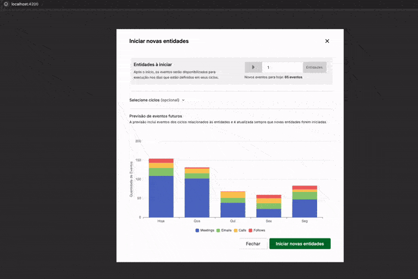

# Desafio de Projeção de Eventos (Meetime)

Este projeto é uma solução para o desafio de desenvolvimento front-end proposto, utilizando Angular para criar uma interface de projeção de eventos baseada em ciclos e entidades. Foi utilizado somente recursos nativos do Angular como Signals + RxJs controlar todo fluxo da aplicação, sem necessidade de uma estrutura robusta para esse controle.

## Demonstração da Usabilidade



## Tecnologias Utilizadas

- **Angular 19**
- **Angular Material:**
- **Echarts/ngx-echarts:**
- **ESLint & Prettier:**

### Bibliotecas Externas

- **Angular Material:** Foi proposto no desafio.
- **Echarts (ngx-echarts):** Escolhida pela sua compatibilidade com Angular 19 e mais próxima que estava no figma do projeto.

### ToDo List

- Implementação completa de testes;
- Adicionar opções de editar e remover ciclos;
- Melhor tratamento de erros;
- Persistência de estado;
- Mudar opções de cores do chart;

### Dificuldades de desenvolvimento

- **Figma:** Achei que o fluxo das telas proposto no figma não estava muito coerente para replicação no código.

---

## Pré-requisitos

- Node.js (v18.x ou superior recomendado)
- Angular CLI (v19)
- npm (v9.x ou superior) ou yarn

## Configuração e Execução

1.  **Clonar o repositório:**

    ```bash
    git clone <URL_DO_SEU_REPOSITORIO_AQUI>
    cd desafio-meetime
    ```

2.  **Instalar dependências:**

    ```bash
    npm install
    ```

3.  **Servidor de Desenvolvimento:**
    Para iniciar o servidor de desenvolvimento local:

    ```bash
    ng serve
    # ou
    npm start
    ```

    Abra seu navegador e navegue para `http://localhost:4200/`. A aplicação recarregará automaticamente ao modificar os arquivos de origem.

## Formatação do código

O projeto utiliza ESLint para análise estática de código e Prettier para formatação automática.

1.  **Executar Lint:**
    Para analisar o código

    ```bash
    npm run lint
    ```

2.  **Executar Prettier:**
    Para analisar o código

    ```bash
    npm run format
    ```
